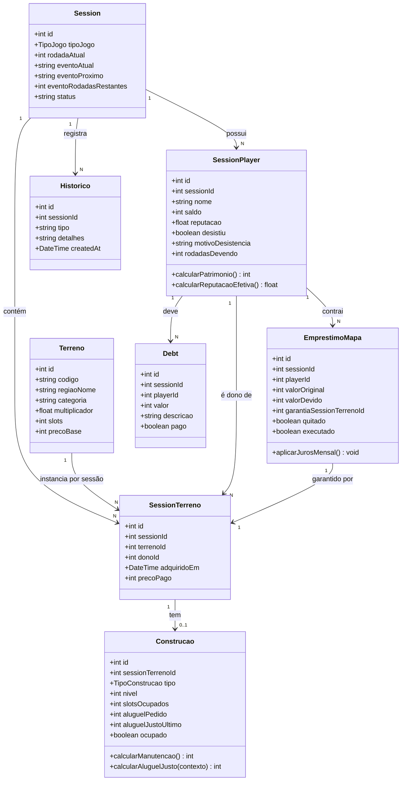
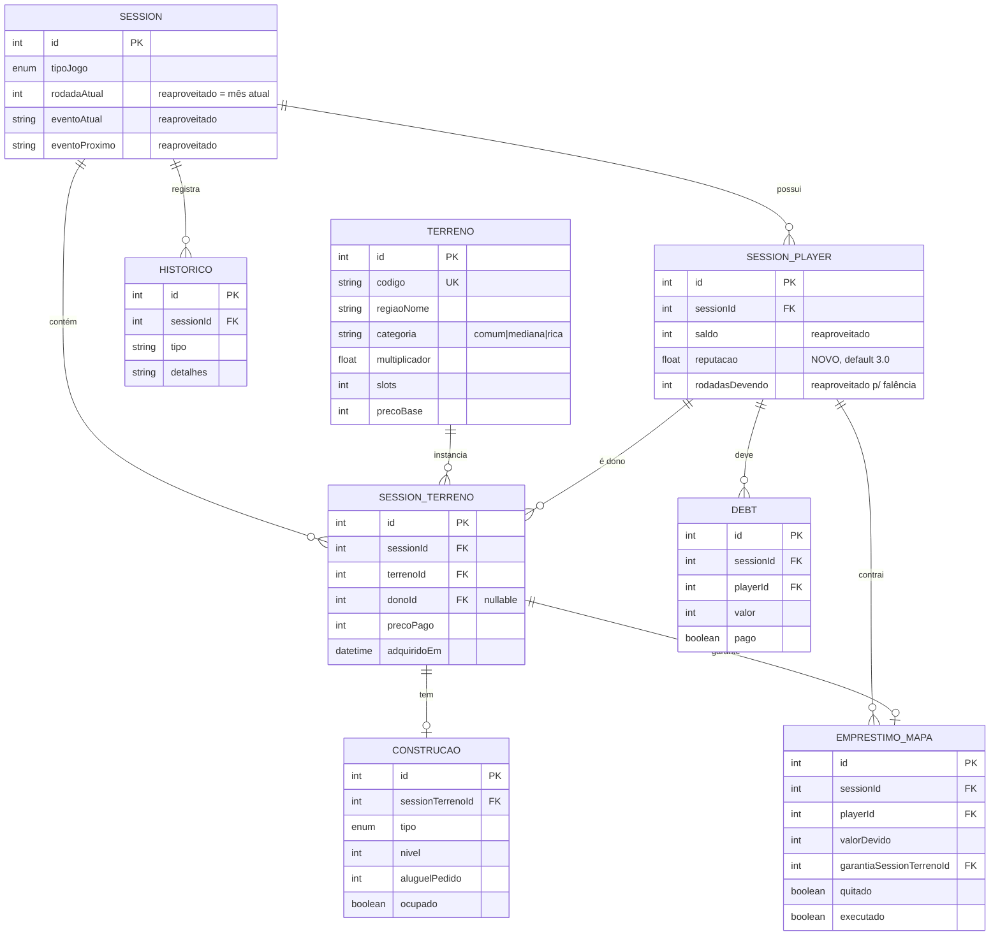
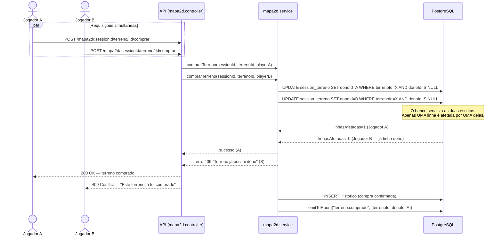
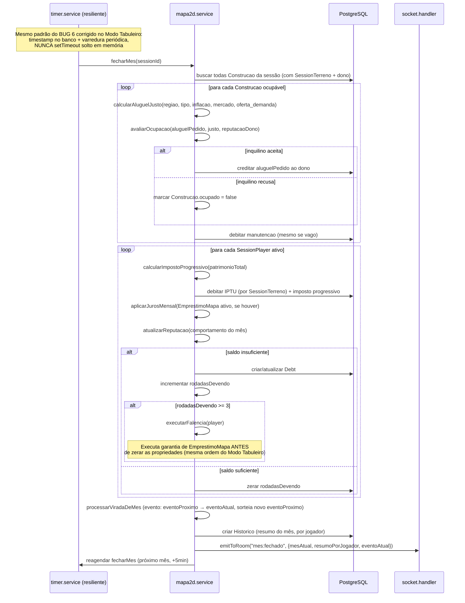
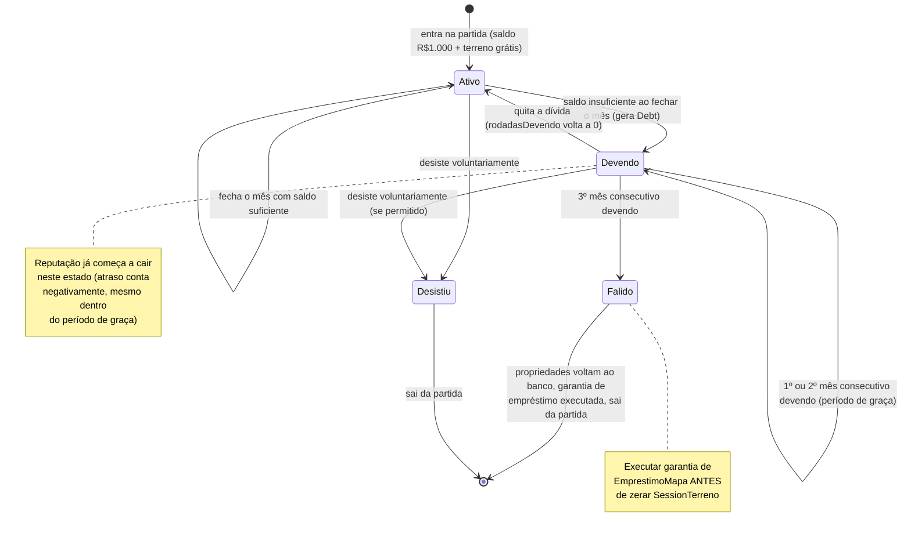
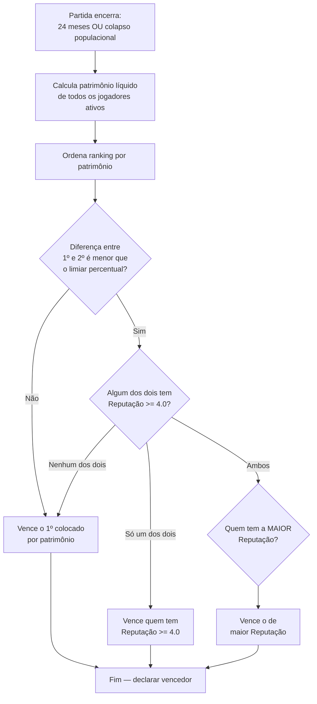

# GameBank 2D — Pacote de UML

> Companion técnico do `GAMEBANK_2D_GDD.md`. Traduz o design em modelo de
> domínio, schema e fluxos. **O agente de implementação deve seguir
> exatamente estas estruturas** — não inventar entidades, campos ou fluxos
> alternativos sem antes confirmar com o time.
>
> Convenções seguidas (auditadas do schema atual): modelos em `PascalCase`,
> campos em `camelCase`, domínio de jogo em português (`Propriedade`,
> `saldo`), infraestrutura genérica em inglês (`User`, `Notification`).

---

## 0. Reaproveitamento — o que já existe e não deve ser recriado

Auditoria do schema atual encontrou dois reaproveitamentos importantes que
**eliminam trabalho** e mantêm o projeto consistente:

| Já existe (Modo Tabuleiro) | Reaproveitado por GameBank 2D como |
|---|---|
| `Session.tipoJogo` (enum `banca` \| `tabuleiro`) | Adicionar valor `mapa2d` |
| `Session.rodadaAtual` | **Mês atual** da partida (mesmo campo, sem criar novo) |
| `Session.eventoAtual` / `eventoProximo` / `eventoRodadasRestantes` | **Evento econômico do mês** — sistema idêntico já existe |
| `SessionPlayer.saldo`, `.desistiu`, `.motivoDesistencia`, `.patrimonyAtDesistir` | Reaproveitados diretamente, sem alteração |
| `Debt` (genérico: sessionId, playerId, valor, descricao, pago) | Reaproveitado para dívidas de impostos/manutenção não pagos |
| `Historico` (genérico, log por sessão) | Reaproveitado para o log de eventos do mês, mudanças de Reputação, execuções de garantia |
| Padrão `Propriedade` (estático) + `SessionPosses` (dinâmico por sessão) | **Espelhado** como `Terreno` (estático) + `SessionTerreno` (dinâmico) |
| Padrão de timer resiliente (varredura periódica + timestamp no banco, corrigido no BUG 6 do Modo Tabuleiro) | **Reaproveitado** para o fechamento de mês (ver Seção 4) |

**O que é genuinamente novo:** `Terreno`, `SessionTerreno`, `Construcao`,
`EmprestimoMapa`, e o campo `reputacao` em `SessionPlayer`.

---

## 1. Diagrama de Classes (Modelo de Domínio)



**Notas de design incorporadas nas entidades:**

- `SessionPlayer.reputacao` — novo campo, `Float @default(3.0)`, só usado
  quando `tipoJogo = mapa2d`
- `Terreno` é **estático**, populado uma vez no startup a partir de um JSON
  de referência (`server/data/mapa2d/terrenos.json`), no mesmo espírito de
  `propriedades.json` do Modo Tabuleiro
- `SessionTerreno` é o análogo direto de `SessionPosses` — dono, quando foi
  adquirido, e o preço efetivamente pago (pode variar por eventos)
- `Construcao.calcularAluguelJusto(contexto)` implementa a fórmula validada
  na Seção 5 do GDD (região × tipo × inflação × mercado × oferta/demanda)
- `EmprestimoMapa` é deliberadamente **separado** do `Emprestimo` já
  existente (Modo Tabuleiro) — a garantia referencia `SessionTerreno`, não
  `SessionPosses`; são domínios diferentes com FKs incompatíveis

---

## 2. Diagrama ER (Schema resumido)



**Constraint crítica (requisito de segurança do GDD Seção 9):**

```
SESSION_TERRENO: @@unique([sessionId, terrenoId])
```

Isso é o que garante, no nível do banco, que um terreno não pode ter dois
donos ao mesmo tempo — combinado com a escrita atômica descrita na Seção 4.

---

## 3. Diagrama de Sequência — Compra de Terreno Concorrente

Implementa o requisito **não-negociável** do GDD (Seção 9): atomicidade via
`UPDATE ... WHERE`, nunca "verificar depois escrever" em dois passos.



**Ponto de implementação crítico:** a chamada ao banco **precisa** ser uma
única instrução condicional (`WHERE donoId IS NULL`), nunca:

```typescript
// ERRADO — TOCTOU, dois passos separados
const terreno = await db.sessionTerreno.findUnique(...);
if (!terreno.donoId) {
  await db.sessionTerreno.update({ donoId: playerId });  // ← janela de corrida aqui
}

// CERTO — atômico, um único passo
const resultado = await db.sessionTerreno.updateMany({
  where: { id: terrenoId, donoId: null },
  data: { donoId: playerId, precoPago, adquiridoEm: new Date() },
});
if (resultado.count === 0) throw new AppError(409, "Terreno já possui dono.");
```

Este mesmo padrão se aplica a **toda ação disputável**: subir de nível,
aceitar sublocação (fase 2), etc.

---

## 4. Diagrama de Sequência — Fechamento de Mês



**Reaproveitamentos explícitos nesta sequência:**
- O ciclo de evento (`eventoProximo → eventoAtual`) é **idêntico** ao já
  implementado no Modo Tabuleiro — mesma função, mesmo padrão de anúncio
  antecipado
- A ordem "executar garantia antes de zerar propriedades" é a mesma lição
  do `MECANICA_EMPRESTIMOS.md` do Modo Tabuleiro
- O timer resiliente (varredura + timestamp) é o mesmo padrão do
  `FIX_TURNO_TRAVADO_CONTADOR.md` — **não reinventar**, adaptar

---

## 5. Diagrama de Estados — Ciclo de Vida do Jogador



---

## 6. Fluxograma — Decisão de Vitória ao Fim da Partida



**Nota de implementação:** o "limiar percentual" (proposto ~12% do
patrimônio do líder, marcado `[A DEFINIR]` no GDD) deve ser uma **constante
configurável**, no mesmo espírito de `economia.ts` do Modo Tabuleiro —
nunca hardcoded inline na lógica de decisão.

---

## 7. Rotas da API (proposta inicial)

Seguindo o padrão do projeto (`Middleware → Controller → Service →
Repository`, rotas em `server/src/api/routes/`):

```
POST   /mapa2d/:sessionId/terreno/:terrenoId/comprar
POST   /mapa2d/:sessionId/terreno/:sessionTerrenoId/construir
POST   /mapa2d/:sessionId/construcao/:construcaoId/subir-nivel
POST   /mapa2d/:sessionId/construcao/:construcaoId/precificar   { aluguelPedido }
POST   /mapa2d/:sessionId/emprestimo/pegar                       { valor }
POST   /mapa2d/:sessionId/emprestimo/quitar
GET    /mapa2d/:sessionId/estado                                 (snapshot completo, para reconexão)
```

Cada rota disputável (comprar, subir-nível) segue o padrão de atomicidade da
Seção 3 deste documento.

---

## 8. Testes — onde vivem (não expostos por rota)

Seguindo exatamente o padrão já estabelecido no projeto (Jest + banco
isolado `gamebank_test`, **nunca** uma rota HTTP viva):

```
server/src/modules/mapa2d/
├── __tests__/
│   ├── terreno.service.test.ts       (unitário — compra, atomicidade)
│   ├── construcao.service.test.ts    (unitário — nível, aluguel justo)
│   ├── fechamento.service.test.ts    (integração — ciclo do mês completo)
│   └── reputacao.service.test.ts     (unitário — cálculo de reputação)
```

Rodar com `make test-ci` (já configurado), banco de teste já isolado — não é
necessário criar nenhuma rota `/testes` nova.

---

## Checklist de conformidade com o GDD

Antes de considerar a implementação "pronta", confirmar:

- [ ] `SessionTerreno` tem `@@unique([sessionId, terrenoId])` no schema
- [ ] Toda ação disputável usa `updateMany` com `WHERE` condicional, nunca
      "ler depois escrever" em dois passos
- [ ] `EmprestimoMapa` executa a garantia **antes** de zerar propriedades na
      falência
- [ ] O timer de fechamento de mês usa o padrão resiliente (timestamp +
      varredura), não `setTimeout` solto
- [ ] `Reputação` é calculada e persistida a cada fechamento de mês, com
      histórico rastreável (via `Historico`)
- [ ] Nenhuma rota `/testes` foi criada — testes vivem em `__tests__/` com
      banco isolado
- [ ] Constantes numéricas (limiar de vitória, coeficientes de reputação)
      ficam em arquivo de configuração dedicado, nunca hardcoded inline
